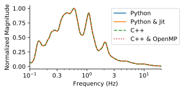
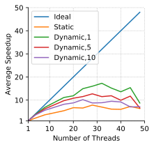
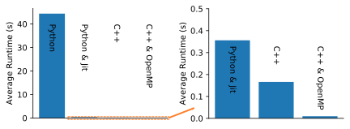

# A C++ Implementation of Konno and Ohmachi Smoothing

> Joseph P. Vantassel, The University of Texas at Austin

## Background

A recent project focused on developing an open-source Python package for
for horizontal-to-vertical spectral ratio (HVSR) processing called
[_hvsrpy_](https://github.com/jpvantassel/hvsrpy)
prompted a study of the computational performance of the HVSR
calculation, however this had to be concluded prematurely. This study presents a
reexamination of the algorithm’s performance.

HVSR processing
involves the following steps: (1) the division of a long time-domain record into
smaller time windows (typically 60 – 360 seconds in length), (2) transformation
of these windows into the frequency domain using the Discrete Fourier Transform
(DFT), (3) the smoothing of these frequency-domain representations
(i.e., spectra), and (4) the division of the smoothed horizontal and vertical
spectra. Initial performance tests on _hvsrpy_ indicated that
approximately 60% of the computational cost incurred in the HVSR calculation was
incurred in the smoothing stage. Therefore, this study focuses primarily on the
smoothing algorithm.

In particular, this study will compare the performance of a
Python implementation, a Python implementation improved using just-in-time (jit)
compilation, a serial implementation of the algorithm in C++, and a parallel
implementation using C++ and OpenMP. This repository is host to the C++
implementations see the [_sigpropy_](https://github.com/jpvantassel/sigpropy)
repository (a dependency of the _hvsrpy_ package) for the Python implementations.

## Results

__Figure 1: Comparison of the results of the four methods. All methods are in excellent agreement.__

__Figure 2: Parallel implementation's strong scaling considering various scheduling schemes.__

__Figure 3: Runtime comparison between the four methods of interest.__

## Want to try it for yourself?

Instructions to compile and run the parallel and serial implementations are provided below.

### Parallel

1. Download or clone the repository.
2. Run: `mkdir build && cd build && cmake -DCMAKE_BUILD_TYPE=Release -DCMAKE_CXX_COMPILER=g++ -DCMAKE_CXX_BUILD_OMP=yes ..`.
3. Run: `make clean && make`.
4. Run: `./smooth ../examples/data.csv smooth_data.csv`.

### Serial

Same as parallel, except with the second step swapped with:

2. Run: `mkdir build && cd build && cmake -DCMAKE_BUILD_TYPE=Release -DCMAKE_CXX_COMPILER=g++ -DCMAKE_BUILD_OMP=no ..`.
